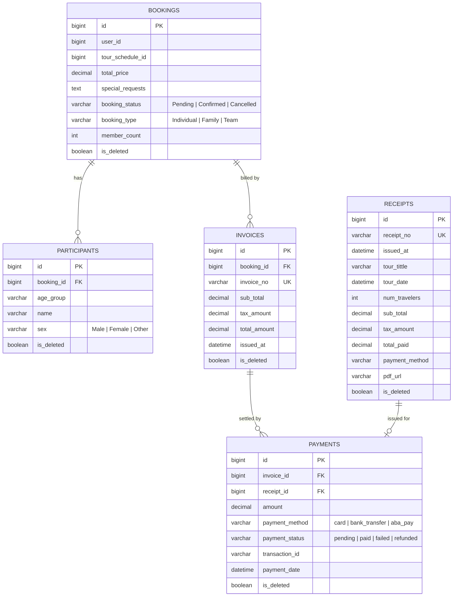

# Payment Module — Entity Relationship Diagram

Covers the tables created in `src/main/resources/db/migration/V1__create_bookings_table.sql`.

## Notes

- All five tables use a soft-delete flag (`is_deleted`); entities apply `@SQLDelete` + `@SQLRestriction` so a `DELETE` request never removes a row, it flips the flag and existing queries transparently filter it out.
- `payments.transaction_id` is generated by the gateway layer (`payment/gateway`) at payment creation time — see [`docs/api/payment-api.md`](../api/payment-api.md).
- A `payment` optionally links to one `receipt` (`receipt_id` nullable); a `receipt` cannot be shared across payments (`@OneToOne`).
